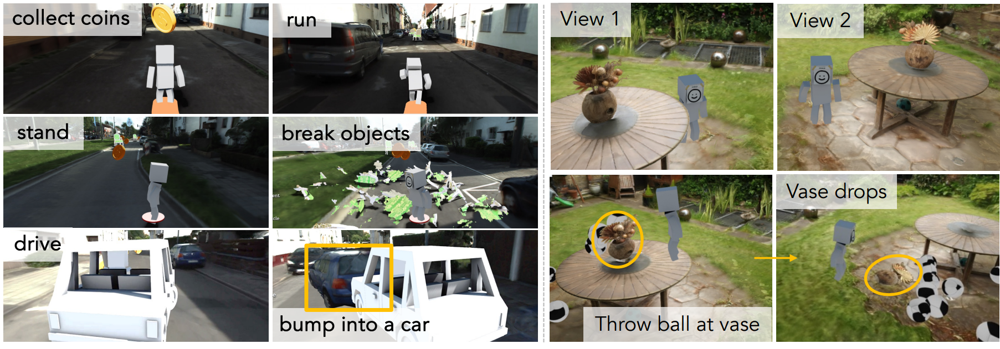

<h1>Video2Game</h1>

<div style="text-align: center;"><h1>Video2Game: Real-time, Interactive, Realistic and Browser-Compatible Environment from a Single Video</h1></div>

<div style="text-align: center;">
<a href="https://xiahongchi.github.io">Hongchi Xia<sup>1,2</sup></a>,
<a href="https://zhihao-lin.github.io/">Zhi-Hao Lin<sup>1</sup></a>,
<a href="https://people.csail.mit.edu/weichium/">Wei-Chiu Ma<sup>3</sup></a>,
<a href="https://shenlong.web.illinois.edu/">Shenlong Wang<sup>1</sup></a>
</div>
<br>
<div style="text-align: center;">
<sup>1</sup>University of Illinois Urbana-Champaign, 
<sup>2</sup>Shanghai Jiao Tong University,
<sup>3</sup>Cornell University
</div>
<br>
<div style="text-align: center;">
CVPR 2024
</div>



## Progress
- [x] NeRF Module
- [x] Mesh Extraction and Post-Processing
- [x] Baking Pretrain Module
- [x] Collision Model Generation
- [x] Evaluation Code
- [ ] Baking Finetune Module
- [ ] GPT-4 Query


## Environment

### Python libraries
* Create conda environment
```
conda create -n video2game -y python=3.7
conda activate video2game
```
* Install pytorch: we test on cuda 11.6 and torch 1.12
```
pip install torch==1.12.0+cu116 torchvision==0.13.0+cu116 torchaudio==0.12.0 --extra-index-url https://download.pytorch.org/whl/cu116
```
* Install torch-scatter
```
pip install torch-scatter -f https://data.pyg.org/whl/torch-1.12.0+cu116.html
```
* Install tiny-cuda-nn
Installation steps are as follows:
``` 
git clone --recursive https://github.com/NVlabs/tiny-cuda-nn.git
cd tiny-cuda-nn
```
Then use your favorite editor to edit include/tiny-cuda-nn/common.h and set TCNN_HALF_PRECISION to 0 (see [NVlabs/tiny-cuda-nn#51](https://github.com/NVlabs/tiny-cuda-nn/issues/51) for details)
```
cd bindings/torch
python setup.py install
```
* Compile CUDA extension of this project
```
pip install models/csrc/
```
* Install nvdiffrast
```
pip install git+https://github.com/NVlabs/nvdiffrast/
```
* Install pymesh
```
pip install https://github.com/PyMesh/PyMesh/releases/download/v0.3/pymesh2-0.3-cp37-cp37m-linux_x86_64.whl
```
* Install other python libraries
``` 
pip install -r requirements.txt
```
## Dataset
We recommend users use the classical COLMAP Format:

We deal with colmap format dataset which composes of the following:
```
Root
 ├── sparse/0/             
 ├── images/    
 ├── normals/ (if user generate corresponding normal priors)
 ├── depth/ (if user generate corresponding depth priors)
 ├── instance/ (if user generate corresponding semantic/instance masks)
```

## Usage
Video2Game is composed of many submodules. We'll introduce the usage of our code one-by-one.

### Generating Priors
#### Geometry Priors
We use normal and depth priors generated from [Omnidata](https://github.com/EPFL-VILAB/omnidata/tree/main/omnidata_tools/torch). 

For the commands to generate priors, please:
1. Download pretrained models by `bash scripts/priors/prior_download_ckpt.sh`.
2. Refer to `scripts/priors/depth_prior.sh` and `scripts/priors/normal_prior.sh` in this repo.

#### Semantic/Instance Priors
* Object mask 

We suggest users to use in COLMAP dataset format in scenario like this, i.e. `datasets/colmap.py`.

For specific format, we represent each mask as `(H, W)` integer numpy array in `.npy` format, ranging from 0 to N-1 for N classes.

For example, in Gardenvase scene, we use instance labels to denote the vase and background, so labels ranges from 0 to 1 for 2 classes.

The labels can be generated from any segmentation tools, and they are in the same file name as the image but end with `.npy` instead of image ext.

Finally, they're put in the same root directory of dataset and named `instance`.

The final directory structure looks like this:

```
Root
 ├── sparse/0/   
 │   │           
 ├── images/
 │   ├──frame_00000.png   
 │   ├──frame_00001.png   
 │   ├──frame_00002.png   
 │   ├──frame_00003.png
 │   │   
 ├── normals/
 │   ├──frame_00000.png   
 │   ├──frame_00001.png   
 │   ├──frame_00002.png   
 │   ├──frame_00003.png
 │   │  
 ├── depth/      
 │   ├──frame_00000.npy   
 │   ├──frame_00001.npy   
 │   ├──frame_00002.npy   
 │   ├──frame_00003.npy
 │   │  
 ├── instance/
 │   ├──frame_00000.npy   
 │   ├──frame_00001.npy   
 │   ├──frame_00002.npy   
 │   ├──frame_00003.npy
 │   │  
```

You can refer to `datasets/colmap.py:L244,L331` for details in how we read those masks.

In training, you need to specify `--num_classes` as the number of classes.

* KITTI-360

We use semantic labels in KITTI-360 scene generated from [mmsegmentation](https://github.com/open-mmlab/mmsegmentation). 

Please copy our sample code `priors/kitti_semantic.py` to the root directory of mmsegmentation and generate labels.


### NeRF Training
Please refer to scripts in `scripts/nerf/`. 

#### Training options

* --normal_mono activates normal prior
* --depth_mono activates depth prior
* --render_semantic activates semantic/instance MLP learning
* --num_classes specifies the number of classes

### Mesh Extraction from NeRF
* Simple mesh extraction

Please refer to scripts in `scripts/extract_mesh/`. 

* Mesh extraction with physical entity separation

1. Using instance label for separation

Take a look at these opts in `opt.py`:
* --mesh_semantic_filter: activate semantic/instance label filtering when extracting mesh (separating mesh)
* --mesh_semantic_filter_semid ${LABEL_ID}: select the semantic/instance id as LABEL_ID
* --extract_mesh_sem_filter_negative: if True, then the density of voxels with semantic/instance id equals to LABEL_ID will be pruned to zero, which means to remove the subpart of mesh with that ID from the output mesh. if False, then the subpart of mesh in that semantic will be extracted.
* --extract_mesh_generate_semantic_boundary: used when we need to auto-complete the textures in the boundary of each subpart of mesh. if True, then it will output a file containing the boundary voxels, which will be used in the following process.
* --extract_mesh_boundary_label ${BOUNDARY_NAME}: if extract_mesh_generate_semantic_boundary is set True, then it will be the name of file that contains boundary voxels.

2. Using assigned bounding box for arbitrary separation
* --extract_mesh_bbox_src ${BBOX_JSON_PATH}: the json file represents a list containing dicts with keys including "T" (the center of bounding box) and "HE" (the half extent of the bounding box)

example: "bbox.json"
```
[
    {
        "T": [0.067019, -0.032404, 0.038153],
        "HE": [0.058699, 0.053415, 0.022]
    }
]
```

The coordinate is the same as the one of extracted mesh.

* --extract_mesh_sem_filter_negative: (reuse the same opt name) if True, then the density of voxels **within the bounding box** will be pruned to zero, which means to remove the subpart of mesh from the output mesh. if False, then the subpart of mesh within the bounding box will be extracted.
* --extract_mesh_generate_semantic_boundary: used when we need to auto-complete the textures in the boundary of each subpart of mesh. if True, then it will output a file containing the boundary voxels, which will be used in the following process.
* --extract_mesh_boundary_label ${BOUNDARY_NAME}: if extract_mesh_generate_semantic_boundary is set True, then it will be the name of file that contains boundary voxels.

### Baking Pretraining
* Simple mesh baking

Please refer to scripts in `scripts/baking/`. 

* Mesh baking when we've extracted separated mesh in the previous step

In `baking_pretrain.py` step:

1. please use `--load_mesh_paths` instead of `--load_mesh_path` in the above baking script. 
2. list each subpart of mesh part in the command line like `--load_mesh_paths ${PATH_OF_PART_0} ${PATH_OF_PART_1} ${PATH_OF_PART_2}...`

In `baking_pretrain_export.py` step:

Using these following opts for each subpart of mesh texture auto-completion:

* --texture_boundary_input_label ${BOUNDARY_NAME}: the same name we've assigned before which named `extract_mesh_boundary_label`.
* --texture_export_substitude_mesh ${PATH_OF_PART_MESH_PART_ID}: the path of mesh subpart which is the same as the input above (one of ${PATH_OF_PART_0} ${PATH_OF_PART_1} ${PATH_OF_PART_2}...)

### Collision Model Generation
For convex collision models, [V-HACD](https://github.com/kmammou/v-hacd) is required for convex decomposition.
For trimesh collision models, [Bounding-mesh](https://github.com/gaschler/bounding-mesh) is required for convex decomposition.

Please refer to scripts in `scripts/collisions/`. 

### Pipeline summary
Take gardenvase scene as an example:

1. generate geometry priors and semantic labels if neccessary
2. train nerf: `scripts/nerf/garden_trainall.sh`
3. extract mesh from nerf: `scripts/extract_mesh/extract_mesh_garden.sh`
4. baking: `scripts/baking/garden_baking_pretrain.sh` and `scripts/baking/garden_baking_pretrain_export.sh`
5. collision model generation: `scripts/collisions/collisions_convex.sh`

### Evaluation
Please refer to scripts in `scripts/eval/`.

## Game Development

### Three.js based game development

Please check the subdirectory `game_dev/`.

To install:

```
npm install
npm install --save @types/three
```
Then run by `npm run dev`

To configure the scene:

* simple game

You need to manually set the config lines in `game_dev/src/ts/world/World.ts` at Line 111, including screen size, intrinsics, and two important variables: 
1. `rendering_meshes` contains the directory that holds textures, mesh and MLP. It will then be fed into function `init_uvmapping()`.
2. `collision_models` contains the directory that holds convex decompostion results including `center.json` and `decomp.glb`.  It will then be fed into function `init_convex_collision()`. 

* more interactive

Becaused of the limitation of Cannon.js, the physical simulation with the exported assets requires lots of labarious tasks. We thus recommend that use Unreal Engine for easier game development instead.

For more features like vase falling in Three.js engine, please refer to our live demo at [Project Page](https://video2game.github.io/), especially the gardenvase one, link [here](https://video2game.github.io/src/garden/index.html).

### Unreal Engine based game development

Unreal Engine (UE) is capable for lots of interact-able physical simulation. It's good for us to directly incorporate the exported textured mesh into UE.

We recommend that users use fully diffuse texture mesh (set `--baking_specular_dim` as zero in baking stage) in UE, and then our exported assets are completely compatible in UE.

For collision models, users could directly resort to the built-in convex decomposition in UE or auto-generated bounding box collision model.

## Contact
Contact [Hongchi Xia](mailto:xiahongchi@sjtu.edu.cn) if you have any further questions. 

## Acknowledgments
Our codebase builds heavily on [ngp-pl](https://github.com/kwea123/ngp_pl), [instant-ngp-pp](https://github.com/zhihao-lin/instant-ngp-pp), [nerf2mesh](https://github.com/ashawkey/nerf2mesh) and [sketchbook](https://github.com/swift502/Sketchbook). Thanks for open-sourcing!.
